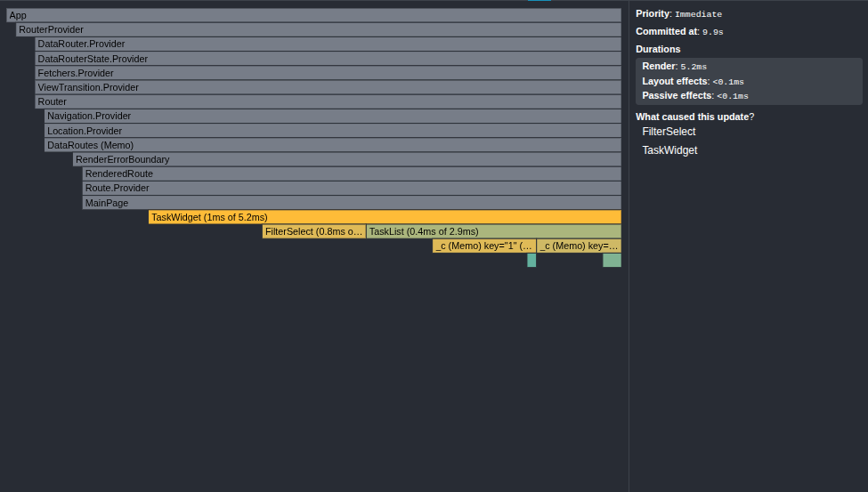
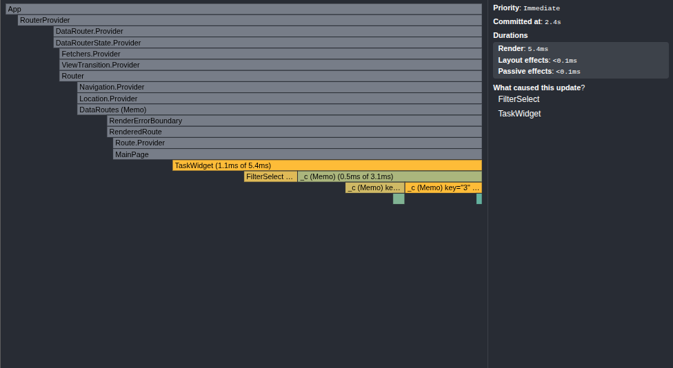

# stydy-sberbank-frontend

# Доработка производительности путем оптимизации:
результаты до оптимизации:

результат после оптимизации:

# Вывод
Улучшено:
Компонент TaskList уменьшил время рендера относительно общего времени, хоть и стал рендериться на 0.1мс больше.

Требует улучшения:
Компонент FilterSelect также перерендеривается, что говорит, что его пропсы меняются каждый рендер. Поэтому с ним необходимо провести аналогичные действия

Наблюдения:
- Компонент FilterSelect часто перерисовывается, что указывает на необходимость его оптимизации
- Компонент TaskCard явно мемоизируется, что предотвращает его от лишних отрисовок
- время рендера компонента TaskWidget практически не изменилось, что говорит, что основные вычисления происходят на его уровне