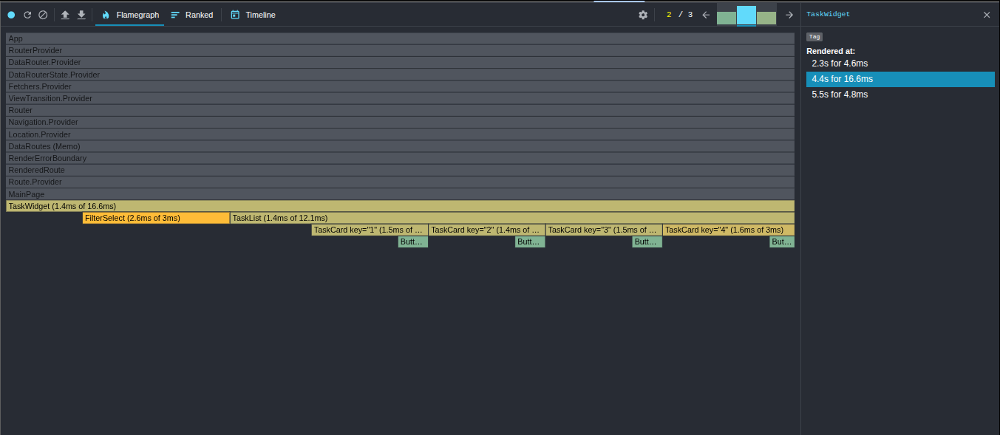
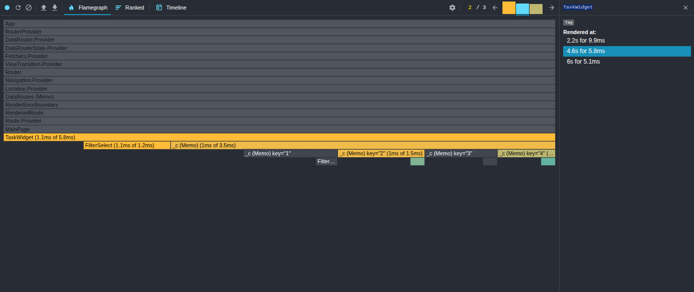

# stydy-sberbank-frontend

# Доработка производительности путем оптимизации:

результаты до оптимизации:

результат после оптимизации:

# Вывод

Улучшено:
- Каждый компонент TaskCard рендерился 1.4-1.6ms из 3ms общего времени. После оптимизации они помечаются мемо и не будут перерендерены при статичных пропсах.
- уменьшено общее время рендера:
  а) было: 4.45s for 18.6ms, 5.55s for 4.8ms
  б) стало: 4.6s for 5.8ms, 6s for 5.1ms

Требует улучшения:
Компонент FilterSelect также перерендеривается, что говорит, что его пропсы меняются каждый рендер. Поэтому с ним необходимо провести аналогичные действия

Наблюдения:

- Компонент FilterSelect часто перерисовывается, что указывает на необходимость его оптимизации
- Компонент TaskCard явно мемоизируется, что предотвращает его от лишних отрисовок
- Максимальное время рендера уменьшилось с 16.6ms до 9.9ms, что является значительным улучшением.
